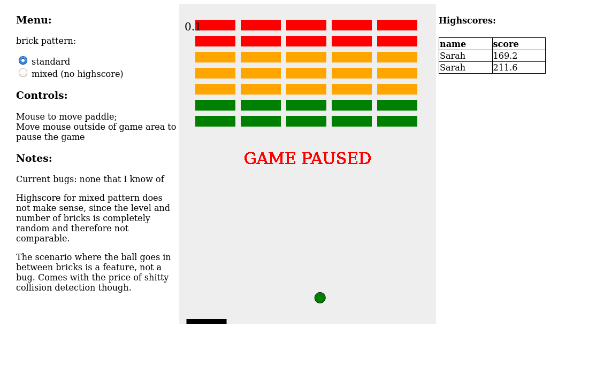
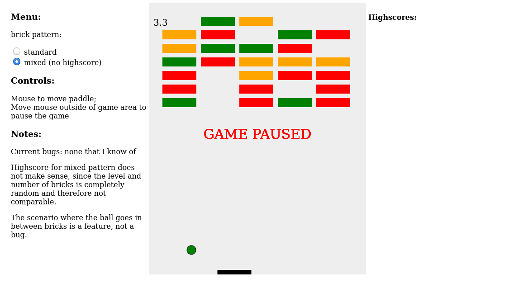

# Brickout Game
Classic brickout game.

You control a pad (on the bottom of the screen) and try to rebounce a moving ball. The ball degrades blocks on collision. Red becomes yellow, yellow becomes green and green blocks disappear on collision. Remove all blocks to win the game.

Play it on [my GitHub Pages](https://sarahlucke.github.io/BrickOutGame/)

---
## Implementation
Based on [this tutorial](https://developer.mozilla.org/en-US/docs/Games/Tutorials/2D_Breakout_game_pure_JavaScript).

The game is completely done in JavaScript using an HTML canvas element. PHP is only used for writing and reading highscores.

### Layout
- info panel on the left for showing a menu, controls, notes etc.
- main game area containing the canvas to play in. The time played (seconds) is shown in the top left corner.
- highscores table

## Installation
You will need a web server (e.g. Apache) with PHP support for writing highscores.
## License
[GNU General Public License 3](LICENSE)
